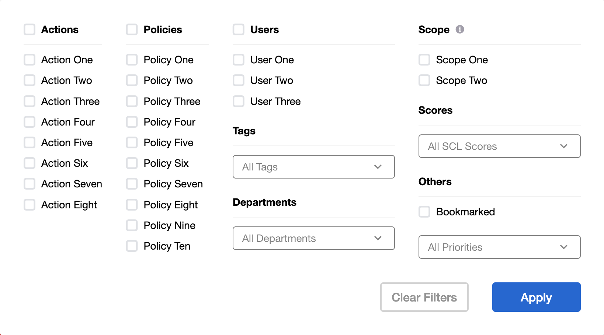
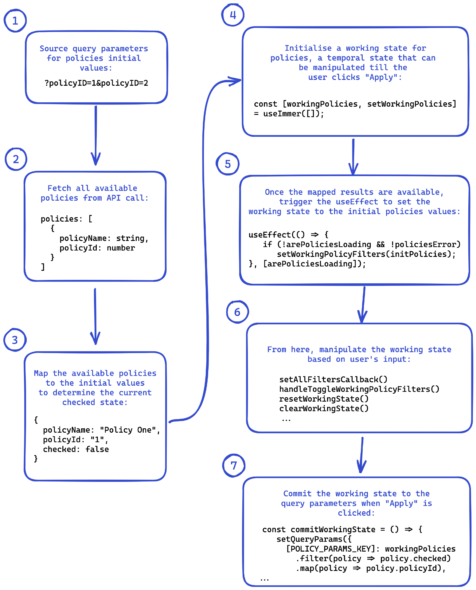

# Filters


## Overview
The `Filters` component allow users to apply a set of filters to their results. Multiple filter types can be applied within groups using OR boolean logic and across groups using AND boolean logic. 

This particular example is being documented as it provide insights into various React patterns and tradeoffs when building user facing features.

## Requirements
1. Users should be able to toggle individual filters and dropdowns.
2. Users should be able to toggle an entire group of checkboxes.
3. Users should be able to toggle all options in a dropdown.
4. Users should be able to clear all filters.
5. Users should be able to send a link with their applied filters to other users. Users who access said link should see the same filters being applied to their results.
6. Filters should only be applied when the user clicks on an action item i.e., an "Apply" button.

The above requirements dictates the following:
1. We need to read from the query parameters from the URL when the page mounts. The URL will act as a form of state when links are shared.
2. We need to seperate the URL state from the state that the user interacts with. If we simply read and write to the URL on each user event, the results will update on every user action.

## Implementation
For brevity, we will only discuss the implementation of the `FiltersProvider` here. This Provider encapsulates most of the business logic that powers the `Filters` component. The implementation details of other individual components i.e., `Checkbox`, `Dropdown` and auxiliary helper methods will not be discussed in full.

For this exercise, we will focus on **Policies**. The other filter groups will follow a similar pattern.

The actual code implementation is redacted but can be provided on request :)


#### 1. Provider pattern:
```
const IncidentFiltersContext = createContext();
```
For this exercise, we use React's provider pattern to help decouple the business logic of manipulating filters from the actual components themself.
We opt for the provider pattern as our state management tool here for the following reasons:
1. It comes natively with React.
2. It is easy to achieve loose coupling with this pattern (Law of Demeter). Only components that are children of the Provider has access to the context. Likewise, it is easy to expose the context to parent components by simply placing the Provider higher up in the hierachy. (What are some downsides of this and how do we mitigate it?)
3. Our team find it much easier to reason with that compared to other libraries like Redux.

While not shown in this exercise, there are predefined filters outside of the `Filters` component that requires the context of the `FiltersProvider` as well.


#### 2. `useQueryParams` hook.
```
 const [queryParams, setQueryParams] = useQueryParams([
  POLICY_PARAMS_KEY
]);

  ...
  
  /**
 * Abstraction to read and set query params from the URL.
 * @param {[]string} keys - Array of query param keys.
 * @returns An object with a key value pair of query params and its values.
 */
export const useQueryParams = (keys = []) => {
  const [searchParams, setSearchParams] = useSearchParams();
  const params = {};
  keys.forEach(key => {
    const value = searchParams.getAll(key);
    params[key] = value;
  });
  return [params, setSearchParams];
};
```
This hook uses the search parameter of the URL as the source of truth for our filters. It behaves similarily to `useState`. It take an array of parameters key as its initial argument. This array is destructed in the hook and used to match the query parameters. The value retrieved will be the initial state of our policy filter.

#### 3. `useQuery` API hooks.
```
const {
  data: policiesData,
  isLoading: arePoliciesLoading,
  error: policiesError
} = usePoliciesFilter();
```

Not all options in the Filters can be determined at compile time (hard-coded). For example, the filter group for policies are sourced by an API call. We use [TanStack Query](https://tanstack.com/query/latest) library to fetch and cache filters populated by an API call. The library also provides helpful abstractions like `isLoading` and `error` which we can use to show intermediate states.

```
export const PoliciesFilterGroup = () => {
  const {
    arePoliciesLoading,
  } = useIncidentFiltersContext();

  if (arePoliciesLoading) {
    return <FilterGroupSkeleton />;
  }
  
return ...
```

### 4. Creating checkbox options.
For filters that are sourced from an API, we await for the data to arrive from the API and coalesce this with any initial values from the query parameters. We create an `initPolicies` object that will have a `checked` property to denote if the checkbox is selected or not.
```
  const initPolicies = useMemo(
    () =>
      policiesData?.policies?.map(policy => ({
        policyId: policy?.id ?? '',
        policyName: policy?.name ?? '',
        policyNameKey: policy?.policy_name ?? '',
        policyEnabled: policy?.is_enabled ?? false,
        checked: policyIdsQueryParams.includes(policy?.id ?? '')
      })) ?? [],
    [policiesData?.policies, policyIdsQueryParams]
  );
```

### 5. `useImmer` API hook.
```
const [workingPolicyFilters, setWorkingPolicyFilters] = useImmer([]);
```
We leverage [immerJS](https://immerjs.github.io/immer/) library to manage the checkbox state. This library provides a way to immutably transform the checkbox states without without having to drill down deep nested objects.

### 6. `useEffect` hook.
Once we have our `initPolicies` object properly populated, we can now use it as our initial values for our working state.
```
useEffect(() => {
    if (!arePoliciesLoading && !policiesError) 
        setWorkingPolicyFilters(initPolicies);
}, [arePoliciesLoading]);
```

### 7. Helper functions.
At this juncture, we have successfully done the following:
1. Source the query parameters for any initial policy values
2. Fetch all available policies from our API endpoint.
3. Created our working state which the user will interact with.
4. Set the working state to the initial state to the API and query params results.

We can now write helper functions to help manipulate our working state.
```
// Abstraction for filter groups to set all their checkboxes or dropdown options.
const setAllFiltersCallback = (setState, checked) => {
  setState(draft => {
    if (Array.isArray(draft)) {
      draft.forEach(x => {
        x.checked = checked;
      });
      return;
    }
    draft.checked = checked;
  });
};

// Pass a boolean to toggle all available policies checkbox.
const handleSetWorkingPolicyFilters = checked =>
    setAllFiltersCallback(setWorkingPolicyFilters, checked);
  
// Abstraction to check if all policies are checked.
const areAllPolicyFiltersChecked = workingPolicyFilters.every(
  policy => policy.checked
);

// If all policies are selected, deselect all of them. Else, select all policies checkbox.
const handleToggleAllPolicyFilters = () => 
  handleSetWorkingPolicyFilters(!areAllPolicyFiltersChecked);
  
// Toggle a single policy checkbox by comparing the ids.
const handleToggleWorkingPolicyFilters = id => {
  setWorkingPolicyFilters(draft => {
    const index = draft.findIndex(x => x.policyId === id);
    if (index !== -1) draft[index].checked = !draft[index].checked;
  });
};
```

And expose the context of all available methods to any child components:
```
const {
    areAllPolicyFiltersChecked,
    arePoliciesLoading,
    workingPolicyFilters,
    handleToggleAllPolicyFilters,
    handleToggleWorkingPolicyFilters
  } = useIncidentFiltersContext();
```

### 9. Applying the filters.
We can apply the working state to the query parameters by setting the `useQueryParams` hook.
```
 const commitWorkingState = () => {
    setQueryParams({
      [POLICY_PARAMS_KEY]: workingPolicyFilters
        .filter(policy => policy.checked)
        .map(checkedPolicy => checkedPolicy.policyId)
    ...
```

## Flowchart
The flowchart below summarizes the logic management for the policy filter group.


